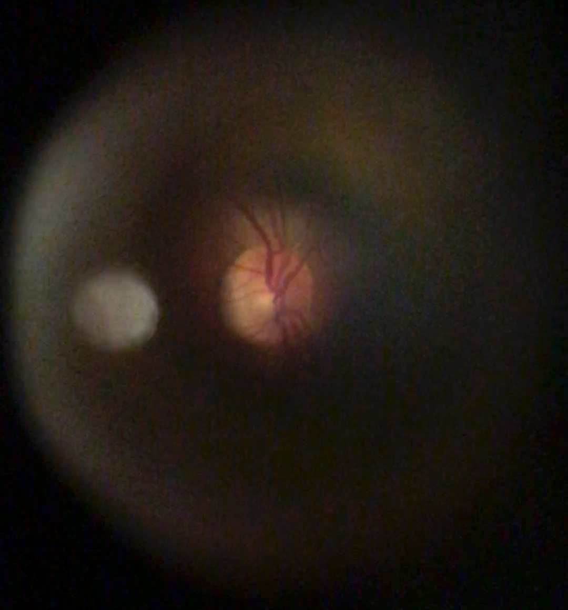

# Lumos
Take a picture of your retinas for eye-disease and cancer screening with our mobile app, machine learning, and 3D-printed iPhone lens.

# iPhone lens

### A image of the retina of someone on our dorm floor using our lens.

# Machine Learning

# Mobile App + Risk Statistics

The deep-learning model we used to assess risk and statistics.

# The Team

# Why it matters

